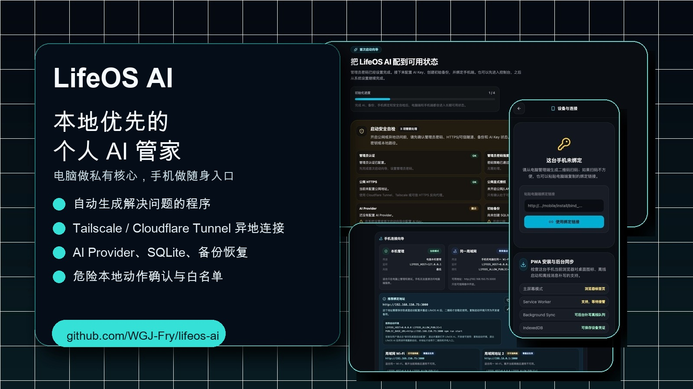
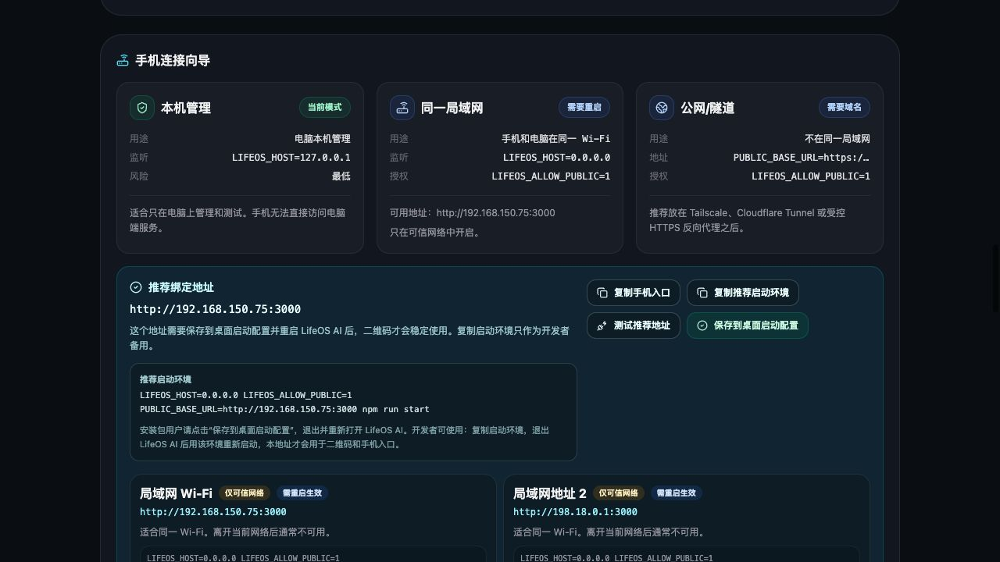

# LifeOS AI

> 中文 | [English](#english)

**LifeOS AI 是一个本地优先的个人 AI 管家/助手：电脑端运行私有核心，手机端成为随身入口。**

[](https://github.com/WGJ-Fry/lifeos-ai/actions/workflows/quality.yml)
[](https://github.com/WGJ-Fry/lifeos-ai/actions/workflows/desktop-release-smoke.yml)
[](https://github.com/WGJ-Fry/lifeos-ai/releases)
[](LICENSE)

<p align="center">
  
</p>

<p align="center">
  <a href="#30-秒看懂">30 秒看懂</a> ·
  <a href="#下载安装">下载安装</a> ·
  <a href="#功能地图">功能地图</a> ·
  <a href="#docker-快速体验">Docker 快速体验</a> ·
  <a href="#english">English</a>
</p>

---

## 30 秒看懂

LifeOS AI 不是单纯的聊天网页。它把你的电脑变成一个**私有 AI 核心**，再把手机变成一个随身可用的**个人 AI 管家**。

- 电脑端：管理 AI provider、本地 SQLite 数据、备份恢复、安全自检、设备绑定、VPN/隧道连接。
- 手机端：扫码绑定后像 App 一样使用，支持聊天、离线队列、设备状态、连接状态和本地动作确认。
- Studio 工坊：当你有记账、规划、查询、整理、打卡、计算、表单、流程面板等具体需求时，AI 会根据当前问题生成可运行的程序来帮你处理，并支持继续调试。
- 异地连接：支持 LAN、Tailscale、Cloudflare Tunnel、可信 HTTPS 反向代理，并会尽量避免生成手机扫不开的本机地址二维码。

<p align="center">
  
</p>

## 真实界面

### 首次启动与安全自检


### VPN / 隧道连接向导



### 手机端设备与连接

<p align="center">
  
  
</p>

## 下载安装

最新版本见：[GitHub Releases](https://github.com/WGJ-Fry/lifeos-ai/releases)

当前公开 Release 以 macOS Apple Silicon unsigned ZIP 为主。Windows NSIS 和 Linux AppImage 已接入构建与 CI smoke，公开资产会在真实安装验证后补齐。

- macOS：下载 Release 中的 ZIP，解压后打开 LifeOS AI。若系统阻止打开，请按 Release 说明处理 Gatekeeper。
- Windows：构建链路已接入，公开 EXE 资产验证中。
- Linux：AppImage 构建链路已接入，公开资产验证中。
- Docker：可以用下面的本地 Ollama 方案快速体验。

## 功能地图

```text
LifeOS AI
├─ 电脑端私有核心
│  ├─ 管理员认证 / CSRF / API 权限保护
│  ├─ SQLite 本地数据
│  ├─ AI provider：Gemini / OpenAI / OpenRouter / 本地模型
│  ├─ AI Key 安全保存、测试、删除和审计
│  ├─ 备份、恢复、恢复任务取消、加密备份
│  ├─ 诊断包、审计日志、脱敏导出
│  └─ Electron 桌面壳、托盘状态、启动失败页
├─ 手机端 PWA
│  ├─ 扫码绑定 / 重新绑定 / 解除绑定
│  ├─ WebCrypto 设备签名与旧 token 迁移
│  ├─ 离线消息队列、单条重试、清空队列
│  ├─ 设备与连接状态
│  └─ PWA 安装、离线 shell、弱网提示
├─ 异地连接
│  ├─ LAN 自动候选
│  ├─ Tailscale 安装、设备、Tailnet、HTTPS Serve 检测
│  ├─ Cloudflare Tunnel / Named Tunnel 辅助配置
│  ├─ 连接测试：health / mobile shell / websocket
│  └─ 二维码自动使用最佳手机可达地址
├─ 本地动作
│  ├─ URL Scheme 白名单
│  ├─ 导航、网页、电话、短信、邮件、快捷指令
│  ├─ 危险动作二次确认
│  └─ 动作日志
└─ Studio 工坊
   ├─ 根据当前问题生成可运行程序
   ├─ HTML / CSS / JS 继续调试
   └─ 沙箱预览与发布
```

## Docker 快速体验

这个路径适合快速体验“读取本地 Markdown，然后回答我忘了什么”。需要 Docker 和 Docker Compose。

Docker 镜像：

```text
ghcr.io/wgj-fry/lifeos-ai:v0.1.1-alpha
```

首次运行会下载 `llama3.2`，模型缓存后启动会更快。

```bash
git clone https://github.com/WGJ-Fry/lifeos-ai.git
cd lifeos-ai

mkdir -p lifeos_vault lifeos_data

cat > lifeos_vault/demo.md <<'EOF'
# Demo memory

- Passport expires in 47 days.
- Project proposal for Tom is due tomorrow.
- Tax filing deadline is in 12 days.
EOF

docker compose up -d
```

打开：

```text
http://localhost:8080/admin/login
```

默认密码：

```text
lifeos-local-demo
```

然后在聊天里问：

```text
What am I forgetting?
```

LifeOS 应该会提到护照、Tom 的项目提案和税务截止日期。

## 本地数据目录

Docker quickstart 默认使用：

```text
./lifeos_vault   # Markdown 笔记
./lifeos_data    # LifeOS SQLite 数据
```

桌面版会使用应用数据目录保存 SQLite、备份、审计日志和运行配置。

## 当前限制

LifeOS AI 仍处于 alpha 阶段。

- 当前公开下载资产还不完整，Windows/Linux 包需要继续真实安装验证。
- macOS 当前公开包不是正式签名公证版本。
- Docker quickstart 主要用于本地 Markdown 体验，不等于完整桌面版安装体验。
- 异地连接需要用户选择 Tailscale、Cloudflare Tunnel 或可信 HTTPS 入口。
- 自动更新 feed 和正式签名分发仍在推进。

## Roadmap

- 完成 signed/notarized macOS 分发。
- 上传真实 Windows NSIS 和 Linux AppImage 资产。
- 继续打磨 Tailscale / Cloudflare Tunnel 半自动配置。
- 强化 PWA 离线队列和后台同步体验。
- 增强 Studio 生成解决问题程序的可靠性。
- 补全自动更新 feed 和发布回滚策略。

---

<a id="english"></a>

# LifeOS AI

**LifeOS AI is a local-first personal AI assistant: a private desktop core plus a mobile PWA companion.**

<p align="center">
  
</p>

## Understand It In 30 Seconds

LifeOS AI is not just another chat page. It turns your desktop into a **private AI core** and your phone into an everyday **personal AI assistant**.

- Desktop core: AI providers, local SQLite data, backups, security checks, device pairing, VPN/tunnel connectivity.
- Mobile PWA: pair by QR code, use it like an app, chat, inspect device state, recover from weak networks, and confirm local actions.
- Studio workshop: when you have a concrete problem such as accounting, planning, lookup, organizing, habit tracking, calculation, forms, or workflow panels, AI generates a runnable program to help solve it and lets you keep refining it.
- Remote access: LAN, Tailscale, Cloudflare Tunnel, and trusted HTTPS reverse proxies, with safeguards against QR codes that only work on the desktop.

## Real Screenshots

### First Launch And Safety Check


### VPN / Tunnel Connection Guide


### Mobile Device And Connection

<p align="center">
  
</p>

## Downloads

Latest builds: [GitHub Releases](https://github.com/WGJ-Fry/lifeos-ai/releases)

The current public release mainly provides a macOS Apple Silicon unsigned ZIP. Windows NSIS and Linux AppImage pipelines are wired into CI smoke checks, and public assets will be uploaded after real installation verification.

- macOS: download the ZIP from Releases and open LifeOS AI after extracting it. If Gatekeeper blocks it, follow the Release notes.
- Windows: NSIS build pipeline exists; public EXE asset is still being verified.
- Linux: AppImage build pipeline exists; public asset is still being verified.
- Docker: use the quickstart below for a local Ollama demo.

## Feature Map

```text
LifeOS AI
├─ Desktop private core
│  ├─ Admin auth / CSRF / API permission protection
│  ├─ Local SQLite data
│  ├─ AI providers: Gemini / OpenAI / OpenRouter / local models
│  ├─ AI key save, test, delete, and audit
│  ├─ Backup, restore, restore cancellation, encrypted backup
│  ├─ Redacted diagnostics, audit logs, data export
│  └─ Electron shell, tray status, startup failure page
├─ Mobile PWA
│  ├─ QR pairing / rebinding / unbinding
│  ├─ WebCrypto device signatures and legacy token migration
│  ├─ Offline queue, single-message retry, clear queue
│  ├─ Device and connection state
│  └─ PWA install, offline shell, weak-network guidance
├─ Remote connectivity
│  ├─ LAN candidates
│  ├─ Tailscale device, Tailnet, and HTTPS Serve detection
│  ├─ Cloudflare Tunnel / Named Tunnel assisted setup
│  ├─ Connection checks: health / mobile shell / websocket
│  └─ Pairing QR uses the best phone-reachable URL
├─ Local actions
│  ├─ URL Scheme allowlist
│  ├─ Maps, web, phone, SMS, mail, shortcuts
│  ├─ Dangerous-action confirmation
│  └─ Action logs
└─ Studio workshop
   ├─ Generate runnable programs for the current problem
   ├─ Continue refining HTML / CSS / JS
   └─ Sandbox preview and publishing
```

## Docker Quick Start

This path is best for quickly trying the local Markdown memory demo. It requires Docker and Docker Compose.

Docker image:

```text
ghcr.io/wgj-fry/lifeos-ai:v0.1.1-alpha
```

```bash
git clone https://github.com/WGJ-Fry/lifeos-ai.git
cd lifeos-ai

mkdir -p lifeos_vault lifeos_data

cat > lifeos_vault/demo.md <<'EOF'
# Demo memory

- Passport expires in 47 days.
- Project proposal for Tom is due tomorrow.
- Tax filing deadline is in 12 days.
EOF

docker compose up -d
```

Open:

```text
http://localhost:8080/admin/login
```

Default password:

```text
lifeos-local-demo
```

Ask in chat:

```text
What am I forgetting?
```

LifeOS should mention the passport, Tom's proposal, and the tax deadline from your local Markdown file.

## Configuration

Docker quickstart uses:

```text
LIFEOS_QUICKSTART=1
LIFEOS_ADMIN_PASSWORD=lifeos-local-demo
LIFEOS_ACTIVE_AI_PROVIDER=local
LOCAL_MODEL_NAME=llama3.2
LOCAL_MODEL_BASE_URL=http://ollama:11434/v1
LIFEOS_VAULT_DIR=/app/vault
```

## Current Limits

- Public downloadable assets are not complete yet.
- The current public macOS build is unsigned and not notarized.
- Docker quickstart demonstrates local Markdown memory, not the full desktop installation experience.
- Remote access requires LAN, Tailscale, Cloudflare Tunnel, or a trusted HTTPS entry.
- Signed distribution and automatic update feed are still in progress.

## License

MIT
