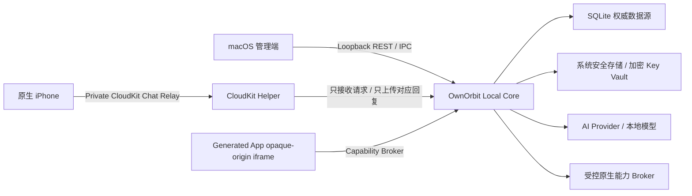

# OwnOrbit AI Apple-only 完整项目执行规划

状态：内部执行事实源  
规划范围：`v0.1.6-alpha` 源码候选至 `v1.0.0`  
当前源码版本：`0.1.6-alpha.0`  
当前公开版本：`v0.1.5-alpha`
当前平台范围：macOS 本地核心与管理端 + 原生 iPhone 客户端

> 本文用于指导开发、评审、测试和发布，不代表其中的计划能力已经发布。
> 对外 README、Release 和宣传只允许描述已经进入公开安装包并通过发布门禁的能力。
> Windows、Linux、Android 和 PWA 不属于当前版本主线；已有兼容代码可以保留，但不得阻塞 Apple 主链路，也不得进入普通首次使用。

执行检查点（2026-07-26）：

- 独立 CloudKit 文字中继、设备签名与信任、Mac 响应签名、回执、持久作业、全局租约和清理生命周期已进入源码候选。
- 手机首次信任后会把 Mac 指纹签入后续请求；本地队列与 CloudKit claim 双重拒绝其他 Mac 抢占。CloudKit 已存在本机签名响应但本地导出标记缺失时，导入会恢复投递证据再处理回执。
- 首次向导已经使用临时 Key 执行真实最小生成验证；本地模型会校验所选模型是否真实存在。
- 首次向导和 AI 设置页会把模型不存在、凭证错误、超时、网络失败等结果转换为中英文可执行建议。
- 手机一次只信任一台 Mac；未知 Mac 响应进入隔离区，不允许自动接管。
- 质量门禁覆盖 lint、API/数据库、前端、E2E、Electron、Apple 契约和发布检查。
- 本检查点只说明源码候选状态。公开安装包、tag、Release、Production Schema 和真实 iPhone 首答证据仍必须单独验收。

## 1. 多 Agent 联合结论

本规划由以下角色基于真实仓库独立审查后合并：

- 软件设计 Agent
- 高级 UI 设计 Agent
- 高级 UE 设计 Agent
- 高级 UX 设计 Agent
- 高级产品经理 Agent
- 高级前端工程师 Agent
- 高级后端工程师 Agent
- 高级架构师 Agent
- 高级安全与隐私 Agent
- 高级 QA / Release Agent

联合结论：

1. OwnOrbit AI 已经具备真实产品骨架，不是演示页面。
2. 当前最大问题不是功能少，而是安全边界、状态一致性、失败恢复和发布真实性仍未完全收口。
3. `v0.1.6-alpha.0` 目前只能称为源码候选，不能称为已公开发布版本。
4. 在 `v0.1.6-alpha` 发布前停止增加新模型、新连接器和新页面，先修完发布阻断项。
5. SQLite 是电脑端事实源；WebSocket 只负责通知；CloudKit 是 Apple 原生端的异步文字通道，不是 VPN、实时网络隧道或 PWA 的透明远程入口。
6. 每一个后续版本只能有一个主目标，未通过量化验收的能力不得写成已发布功能。
7. 不允许通过默认打开“完整 CloudKit 数据同步”来实现首答；文字 AI 中继必须与聊天历史、记忆、任务和生成应用同步彻底分离。
8. 当前公开发布结论仍为 No-Go：源码链路已经形成，但“干净 Mac 安装包 → AI Key → 真实 iPhone 发送 → 收到首答”的同一 commit 发行证据尚未完成。

## 2. 产品契约

OwnOrbit AI 的稳定产品形态固定为：

- Mac 端：本地核心、SQLite、AI Provider、设备管理、备份恢复、安全与高级设置。
- iPhone 端：日常 AI 对话、回复等待与失败恢复；其他工具在首答稳定后再逐步开放。
- 普通首次使用：安装 Mac、设置密码、配置并真实验证一个 AI Key、在 iPhone 启用 iCloud AI、发送并收到第一条 AI 回复。
- 首次使用不得出现二维码、LAN、VPN、Tunnel、入口文件、完整数据同步、备份或 Studio 术语。
- 高级能力：完整数据同步、Studio、数据连接器、原生动作和 Web/PWA 兼容入口从主流程中移出。
- 本地优先：SQLite 是本机权威数据源；AI Key 不返回前端，不进入普通备份。
- 诚实边界：使用云 AI、Cloudflare 或 CloudKit 时，相关请求会离开电脑；不得宣传“所有数据永不离开本机”。

### 2.1 连接方式的产品定义

| 方式 | 能力 | 不能声称 |
| --- | --- | --- |
| CloudKit 文字中继 | 原生 iPhone 的签名文字问题与对应回复 | 不上传历史、记忆、任务、应用状态，不是 VPN 或实时流 |
| CloudKit 完整数据同步 | 用户在高级设置中逐类明确选择的数据 | 默认关闭，不能与首答绑定 |
| LAN / Tailscale / Cloudflare | 保留为高级 Web 兼容入口 | 不进入 Apple-only 首次流程，不作为 v0.1.6 首答前提 |
| iCloud Drive | 兼容旧交接文件 | 不传输实时聊天，不作为新用户路径 |

### 2.2 CloudKit 文字中继隐私契约

1. 新建独立 `LifeOSChatRelayZone`，仅允许 `LifeOSDeviceKey`、`LifeOSChatRequest`、`LifeOSChatResponse`、`LifeOSChatReceipt`。
2. Mac 在 CloudKit helper、container 和账户可用时默认进入 `armed_receive_only`，只接收中继请求，不上传本地聊天、记忆、任务或生成应用。
3. iPhone 必须显式启用 iCloud AI；每次发送即授权上传该问题，并接收与其内容 hash 匹配的回复。
4. 完整数据同步保持 `enabled=false`、`selectedDataTypes=[]`、`autoSync=false`，首次上传和持续同步分别确认。
5. `(sourceDeviceHash, conversationId)` 必须建立所有权；中继不得读取同名本地会话或其他设备上下文。
6. Push 是优先唤醒，Mac 30–60 秒轮询和 iPhone 等待首答时 3–5 秒前台轮询是兜底。

## 3. 当前真实完成度

| 模块 | 当前状态 | 真实边界 |
| --- | --- | --- |
| 管理员认证与 API 权限 | 源码门禁候选 | 有 scrypt、会话、CSRF、锁定、初始化边界、凭证版本撤销和设备 scope |
| SQLite、migration、备份恢复 | 源码门禁候选 | 有 WAL、35 个迁移、脱敏/加密备份、恢复校验与取消；仍需干净安装验收 |
| AI Provider 与 Key | 源码门禁候选 | Key 后端安全存储；首次向导使用临时 Key 做最小真实生成和所选模型校验 |
| 原生 iPhone | 源码候选 | 有 CloudKit UI、签名设备身份和真机证据；尚无 TestFlight/App Store 安装路径 |
| CloudKit 原生聊天 | 源码门禁候选 | 独立文字中继、签名请求、可信 Mac 绑定、签名响应、回执、租约、崩溃恢复与清理已完成；仍需 Production Schema 和真实首答发行证据 |
| Studio | Alpha | 有生成、版本、修复建议、烟测和回滚；仍需安全、离线依赖和自动修复闭环 |
| 日历与任务 | 受控连接器 | 有预览、确认写入和审计；不是长期后台双向同步 |
| 原生动作 | 窄安全桥 | URL Scheme、Shortcuts 等有限能力；不是完整 OS 自动化 |
| Mac 分发 | Alpha | 可构建桌面包；正式签名、公证、staple 和干净机安装证据未完成 |
| 自动更新 | 未默认启用 | unsigned alpha 继续手动下载和 SHA256 校验 |

## 4. 目标架构与信任边界



架构规则：

1. SQLite 是聊天、记忆、设备、任务、审计和持久作业的权威数据源。
2. WebSocket 事件必须从认证主体派生，只做状态提示和增量通知，不能成为唯一事实源。
3. 所有外部副作用都采用“先保存意图，再执行，再对账”的幂等 outbox 模型。
4. CloudKit 文字中继只承载经过签名、限时、限能力的请求与对应回复；完整数据同步使用独立配置、zone 和 checkpoint。
5. Generated App 只能通过宿主 Capability Broker 访问存储、网络和本地动作。
6. Electron 主窗口只允许本机应用 origin，任何外部地址都交给经过协议白名单的系统浏览器。
7. 未来将 Local Core 从 Electron Main 故障域中拆出，保持 SQLite 单写者。

## 5. 版本总路线

| 版本 | 唯一主目标 | 发布级别 |
| --- | --- | --- |
| `v0.1.6-alpha.0` | 内部工程候选，完成安全底座与 Apple 路线拆分 | Internal Alpha |
| `v0.1.6-alpha.1` | Apple First Answer：Mac + iPhone 获得第一次文字回复 | Alpha |
| `v0.1.7-alpha` | iPhone 在锁屏、弱网、换网、重启和账号切换后可靠恢复 | Alpha |
| `v0.1.8-alpha` | Studio 从现实问题生成可持续使用的解决程序 | Alpha |
| `v0.1.9-alpha` | 原生动作和数据写入可授权、可撤销、可审计 | Alpha |
| `v0.2.0-beta` | 非开发者可安全安装、升级、恢复和诊断 | Beta |
| `v0.3.0-beta` | 记忆、日历、任务和多端数据形成可靠长期闭环 | Beta |
| `v0.4.0-rc` | 长期运行、性能、无障碍、可观测性和发布供应链收口 | RC |
| `v1.0.0` | 普通用户可连续 30 天稳定自用 | Stable |

## 6. v0.1.6-alpha：发布与安全收口

唯一目标：从全新安装 Mac 到原生 iPhone 通过独立 CloudKit 文字中继收到第一条 AI 回复，过程真实、可复现、可安全发布。

本版本冻结新功能，不再新增模型、Provider、连接器、Studio 页面或自动化类型。

### 6.1 安全发布阻断项

1. 管理员首次设置只允许 loopback 或 Electron 一次性 bootstrap，拒绝远程抢先初始化和恶意 Origin。
2. 修改管理员密码后撤销全部旧会话，只保留重新签发的新会话。
3. 设备签名 nonce 持久化消费，HTTP 和 WebSocket 均不可重放。
4. 建立 `admin / web-device / cloudkit-chat / system` 权限矩阵；CloudKit 身份不能认证 REST 或 WebSocket。
5. WebSocket 增加 Origin、Host、schema、事件白名单、topic ACL、64 KiB 载荷上限、连接限速、心跳、背压和连接替换保护。
6. Electron 主窗口拦截外部导航，`openExternal` 使用协议白名单，所有 IPC 校验 sender frame。
7. Studio 运行时依赖本地化；未批准 network capability 时不得加载任何公网脚本、图片、媒体、Beacon 或 WebSocket。
8. macOS 数据目录使用 `0700`，SQLite、WAL、SHM、备份、恢复文件和日志使用 `0600`。
9. 非回环服务默认要求可信 HTTPS；裸公网 HTTP 不允许管理员登录、配对或密钥管理。
10. 上游 AI 错误统一脱敏，不把 Provider body、Key、用户内容或本机路径写入 stderr、审计或诊断包。

### 6.2 数据与消息一致性

1. 聊天发送改为持久命令：一个 `commandId` 串起用户消息、AI 作业、助手消息和最终状态。
2. 全局幂等键使用 `(deviceId, mutationId)`，重复提交只能产生一次业务结果。
3. `client_state` 增加 revision/CAS；过期 revision 返回 `409` 并进入可见冲突处理。
4. 离线队列不得静默淘汰正文；容量不足时明确失败，支持跨标签页互斥。
5. 聊天和离线正文以 IndexedDB 为主，清理完整的明文 `localStorage` 镜像并提供无损迁移。
6. migration 增加 checksum、前后置结构断言、半执行恢复和重复执行测试。
7. 恢复流程使用临时文件、完整性检查、版本检查、空间检查、`fsync` 和原子替换。
8. 日历等外部写入必须先保存操作意图和幂等键；无法完成可靠对账的写入继续保持关闭且不宣传。

### 6.3 首次体验和 UI 收口

1. 严格保持“一屏一件事”：设置密码、真实验证 AI、在 iPhone 启用 iCloud AI、发送问题、收到首答。
2. 每屏最多一个高亮主按钮、两个输入项；高级诊断折叠到高级设置。
3. AI Key 保存后执行最小真实推理；无效、欠费、模型不存在和超时均给出本地化可执行建议。
4. 初始化完成条件必须包括：强密码、真实 AI 测试成功、iPhone 设备身份有效、手机收到首条回复。
5. 首答使用显式状态机：未启用、上传中、等待 Mac、处理中、已回复、Mac 无响应、Key 错误、过期、可重试。
6. v0.1.6 的 iPhone 首页只突出聊天；工具和设备管理不与首答竞争注意力。
7. 清除 `JARVIS`、硬编码姓名、随机头像和无标识模拟遥测。
8. 中文和英文主链路完全对应；错误显示 `code + params` 的本地化文案，不直接显示英文后端 message。
9. 手机一次只信任一台 Mac；换电脑必须由用户在“设备与连接”中明确确认，不做静默自动故障转移。
10. CloudKit 文字中继的消息与响应幂等，但模型执行只能保证 at-least-once；发布说明必须明确极端断网场景可能重复计费。

### 6.4 v0.1.6 量化验收

- 相同签名并发 100 次，只允许 1 次成功；进程重启后仍不可重放。
- 未知 WebSocket 事件拒绝率 100%；超限帧关闭；连续重连 1,000 次不误删新连接。
- Electron 对 `file:`、`javascript:`、`data:`、未知 scheme 和外部顶层导航拦截率 100%。
- 断网、超时、重载各循环 20 次，聊天消息零丢失、零重复业务写入。
- 100 条历史聊天和离线消息迁移至 IndexedDB，正文零丢失，旧明文键不再保留。
- 10 个无效 Key/模型组合全部阻止完成引导；有效 Key 完成最小真实回复。
- 20 次全新安装中至少 18 次在 5 分钟内完成 iPhone 首答，20/20 在 8 分钟内完成。
- `320x568`、`390x844`、`768x1024`、`1440x900` 无遮挡、横向滚动或按钮溢出。
- tag、package、lock、README、Release Notes、GHCR、安装包、manifest、provenance 和 SHA256 指向同一干净 commit。
- CloudKit Production Schema 已部署；Mac 包、iPhone 构建和 Schema 可追溯至同一干净 commit。
- 默认中继待命时，iPhone 发送前本地聊天、记忆、任务和应用记录上传数为 0。
- Push 丢失时，仅靠轮询兜底也能在 2 分钟内收到首答，且完整数据同步仍关闭。

### 6.5 v0.1.6 明确不做

- 不承诺全平台零配置异地连接。
- 不发布 Windows、Linux、Android 或 PWA 新版本。
- 不承诺 CloudKit 实时流式 PWA。
- 不承诺完整日历/任务双向同步。
- 不承诺 Studio 无人值守修复。
- 不承诺完整 OS 自动化。
- 不对 unsigned alpha 开启静默自动更新。

## 7. v0.1.7-alpha：异地与多端可靠性

唯一目标：手机在蜂窝网络、换网、锁屏、电脑重启和多设备并发时仍能可靠聊天。

核心范围：

- CloudKit Push 优先，Mac 30–60 秒拉取兜底，iPhone 等待回复时 3–5 秒短轮询。
- 覆盖锁屏、回前台、Wi-Fi/蜂窝切换、Mac 睡眠/唤醒、重启和 iCloud 账号切换。
- 完整 Web 远程入口保留在高级兼容设置，不进入该版本主目标。
- 建立追加式 mutation/event log、revision/CAS、冲突版本和 WebSocket cursor resume。
- 设备密钥支持轮换、撤销、重新绑定和丢失恢复。
- 后台任务显示阶段、耗时、取消、重试和诊断，应用重启后恢复。

量化验收：

- Wi-Fi/蜂窝切换 50 次、锁屏/恢复 30 次、电脑重启 20 次，无确认数据丢失。
- 交互式 HTTPS 路径 P95 重连不超过 10 秒；失败时 5 秒内显示唯一修复动作。
- 两设备累计 10,000 次 mutation，已确认数据丢失和重复业务结果均为 0，30 秒内收敛。
- 72 小时远程长测通过；7 天 1,000 次 CloudKit 文字往返成功率不低于 99%。
- CloudKit 锁屏/后台 push 成功率不低于 95%，失败后 polling fallback 可恢复。

## 8. v0.1.8-alpha：Studio 问题解决闭环

唯一目标：用户描述当前问题后，Studio 生成一个安全、可运行、可继续修复的程序。

核心范围：

- 统一流程：问题描述、蓝图、权限解释、生成、静态检查、运行、验收、修复、版本对比、回滚。
- 模板库覆盖记账、规划、查询、整理、打卡、计算、表单和流程面板。
- Generated App 所有运行依赖本地化或 hash 固定，不依赖运行时公网 CDN。
- 修复任务进入持久作业队列，支持取消、重试、重启恢复和死信。
- 自动修复只产生可审查提案；危险能力和最终发布仍由用户确认。
- 手机端只运行已发布工具，电脑端负责生成和编辑。

量化验收：

- 20 个固定现实问题首轮可用率至少 80%，一次修复后至少 95%。
- 20/20 生成程序在断网后仍可打开和运行。
- 1,000 个恶意沙箱用例无越权导航、存储、私网访问或网络外传。
- 100 次保存、重开、升级、版本对比和回滚无状态丢失。
- 未授权 capability 执行成功数为 0；授权和撤销记录审计覆盖率 100%。
- 在受控 Provider 下，生成到可运行预览的 P90 不超过 60 秒。

## 9. v0.1.9-alpha：安全原生动作

唯一目标：把必要的本地动作做成可授权、可撤销、可审计的窄能力，而不是无限制控制电脑。

核心范围：

- 建立统一权限中心：一次授权、持续授权、拒绝、过期、撤销和执行记录。
- 所有原生动作使用一次性 action token，并要求宿主在场确认高风险动作。
- 稳定支持剪贴板、白名单 Shortcut、Finder 定位和白名单 App 打开。
- 日历、提醒事项和文件写入使用预览、确认、幂等 outbox、结果对账和回滚。
- Shell 和任意命令执行继续阻断，不进入普通产品能力。
- 不支持的平台明确显示不可用，不模拟成功。

量化验收：

- 未授权动作 200 次测试零执行。
- 权限撤销后立即生效，20/20 后续动作均被拒绝。
- 四类稳定动作各执行 20 次，成功率 100%。
- 所有成功、失败、阻断和撤销均写入审计，敏感测试集脱敏率 100%。
- 外部写入前后分别注入崩溃，同一幂等键 20 次只产生一次业务结果并可对账。

## 10. v0.2.0-beta：Apple 安装、升级与恢复

唯一目标：非开发者可以安全安装、升级、回滚和导出诊断。

核心范围：

- macOS signed/notarized/stapled 分发轨和 TestFlight iPhone 分发轨。
- unsigned 开源构建继续保留，但明确风险并只支持手动更新和 SHA256。
- Electron Local Core 逐步从 Main 进程拆为独立子进程，保持 SQLite 单写者。
- 建立 N-2、N-1、current migration 与备份恢复兼容矩阵。
- signed 分发试运行 HTTPS 更新 feed、分批更新、失败回滚和 feed 停止开关。
- Mac 首次启动、服务失败、日志导出、卸载重装和数据保留体验。

量化验收：

- macOS arm64/x64 各 10 次干净安装成功率 100%，TestFlight iPhone 20 次安装与升级成功率 100%。
- 从最近两个公开版本升级共 30 次，数据库零丢失。
- 跨版本备份恢复 30 次完整性通过率 100%，恢复时间 P90 不超过 10 分钟。
- 更新下载、签名、hash 或迁移任一失败时，20/20 自动回到可启动状态。
- 7 天 soak 无数据损坏；beta 用户 crash-free session 不低于 99%。

## 11. v0.3.0-beta：长期数据与连接器

唯一目标：记忆、任务、日历和多设备数据形成可解释、可恢复的长期闭环。

核心范围：

- 统一 Conversation、Knowledge、Task、Calendar、Device 和 GeneratedApp 领域数据。
- 本地 Markdown 记忆增加增量索引、来源、截止日期置信度和冲突解释。
- Apple Calendar、Google Calendar/Tasks 和系统提醒事项进入长期同步作业。
- 使用增量游标、删除传播、权限撤销、冲突策略和周期对账。
- 通用 `jobs / job_attempts / outbox` 支持 lease、heartbeat、取消、重试、死信和启动恢复。
- 备份明确列出包含项、排除项和恢复后需要重新授权的外部连接器。

量化验收：

- 每个任务状态注入进程终止，均在两倍 lease 时间内恢复。
- 两端对同一任务或事件并发修改 1,000 次，冲突均可见、可选择、可恢复。
- 删除、权限撤销和账号切换各 100 次，无幽灵记录或继续越权同步。
- N-2/N-1/current 备份恢复 20/20 成功，SQLite `integrity_check`、FK 和领域不变量全部通过。
- 连续 14 天同步无未解释数据丢失，死信任务均有用户可执行修复入口。

## 12. v0.4.0-rc：长期质量收口

唯一目标：证明系统可以长期运行，并完成性能、无障碍、国际化、可观测性和供应链门禁。

核心范围：

- 请求 ID、结构化脱敏日志、API 延迟、错误率、任务深度、重试和备份新鲜度指标。
- WebKit、Firefox、Chromium、真实 Mobile Safari 和三桌面系统测试矩阵。
- 中英文关键页面视觉回归、键盘流程、VoiceOver、200% 缩放和 reduced motion。
- CodeQL、secret/license scan、SBOM、容器扫描、镜像签名和 attestation。
- CI Action 固定 commit SHA，Node/Docker 版本对齐。
- RC 阶段冻结新架构和新功能，只接受修复、文档和兼容性工作。

量化验收：

- 本地 72 小时故障注入无数据损坏。
- 真实设备 7 天、1,000 次远程/CloudKit 往返无确认丢失或重复业务结果。
- 8 个关键页面状态、4 个视口、2 种语言进入视觉回归。
- 自动无障碍扫描 Critical/Serious 为 0，核心流程可仅用键盘完成。
- API p95 小于 200 ms，移动端 LCP 小于 2.5 秒，AI 取消在 2 秒内生效。
- 高危依赖为 0，发布产物具备 SBOM、provenance、签名和 digest。

## 13. v1.0.0：长期自用稳定版

唯一目标：普通用户可以连续 30 天把 OwnOrbit 作为手机日常 AI 入口。

发布验收：

- 至少 20 名真实用户完成 30 天试用，D30 留存不低于 60%。
- 留存用户至少 70% 的活跃天数从手机发起使用。
- 聊天传输成功率不低于 99.5%，重复业务结果低于 0.1%，确认数据丢失为 0。
- 95% 的备份、重连和设备恢复演练在 10 分钟内完成。
- RC 冻结至少 14 天，并由两套独立干净环境完成安装、升级、恢复和远程连接复验。
- 未关闭 P0、P1 和关键 Sev2 为 0。
- 所有公开能力都有对应版本、自动化测试、真实设备证据、安装资产和用户文档。

## 14. 跨版本质量门禁

每个 Apple 主线功能必须同时完成：

1. 代码和 migration。
2. API/状态模型和失败恢复。
3. 中英文文案。
4. 键盘、焦点、触控尺寸和屏幕阅读器状态。
5. 单元、API、E2E、桌面或原生测试。
6. 安全威胁场景与脱敏验证。
7. 备份、升级、回滚或禁用路径。
8. README、Release Notes 和版本事实同步。

每日质量门：

```bash
npm run lint
npm test
npm run test:desktop
npm run release:check:unsigned
```

发布候选还必须通过：

```bash
npm run test:apple-native
npm run remote:mock-smoke
npm run release:artifacts:check
npm run version:truth:release
npm run github:public:check
```

并提供：

- 同一 SHA 的 Mac 与 iPhone 构建记录。
- 真实设备与真实网络脱敏证据。
- Production CloudKit、签名或外部 Provider 的人工验收证据。
- 安装包 SHA256、manifest、provenance、GHCR digest 和匿名拉取结果。

## 15. Agent 把关流程

每个工作包必须经过以下阶段：

| 阶段 | 必须参与的 Agent | 输出 |
| --- | --- | --- |
| Scope Gate | 产品经理、软件设计 | 用户结果、非目标、版本归属、可量化验收 |
| Architecture Gate | 架构师、后端、安全 | ADR、信任边界、数据模型、migration、回滚 |
| Experience Gate | UX、UE、UI | 主流程、失败恢复、状态、响应式、中英文、无障碍 |
| Implementation Gate | 前端、后端、平台工程 | 分模块实现、测试、诊断和文档 |
| Verification Gate | QA、Security、Release | 自动化结果、攻击测试、真实设备证据、Go/No-Go |

规则：

- 缺少 Scope Gate 或 Architecture Gate，不开始编码。
- 安全和数据一致性问题不能以“Alpha”作为豁免理由。
- 任何 Agent 提出有文件证据的发布阻断项，必须修复或显式关闭对应功能。
- Agent 评审结论要写入工作包记录，不能只留在聊天中。
- 未通过 Verification Gate 的提交不得推到公开 tag，不得更新 `latest`。

## 16. Git 与发布回滚规则

1. 当前未提交工作区先形成可复现基线；在测试通过前不直接推送 `main`。
2. 后续工作使用 `codex/` 前缀分支，每个工作包独立提交。
3. 任一门禁失败：不发布、不更新 `latest`，先修复；无法修复时只回退本工作包，不触碰用户其他改动。
4. tag 一旦推送不得移动，不替换同名资产；修复使用新的 prerelease 或 patch tag。
5. 数据库 migration 只允许 roll-forward；升级前自动备份，旧程序不得直接打开已迁移数据库。
6. 已公开版本出现数据损坏、安全问题、签名/hash/provenance 不一致时，立即停止 rollout 和更新 feed，并把用户引导回上一已知良好版本。
7. unsigned alpha 永远不启用不经确认的静默更新。

## 17. 需要外部人工条件的事项

代码和自动化可以在仓库内完成，但以下事项不能由源码单独证明：

- CloudKit Development Schema 部署到 Production。
- Apple entitlement、APNs、Developer ID、公证、staple 和真实 iPhone 后台/锁屏测试。
- TestFlight / App Store Connect 构建、审核和真实安装路径。
- 各 AI Provider 的真实 Key、配额、计费状态和服务可用性。
- macOS 干净机器与真实 iPhone 安装证据。
- 真实用户 5 分钟首次使用和 30 天留存数据。

这些事项必须作为人工验收记录进入发布证据，不能由 Mock 或模拟器代替。

## 18. 立即执行顺序

### 第一批：v0.1.6 安全底座

1. 冻结并验证当前源码候选，建立本地安全检查点。
2. 修复管理员 bootstrap、改密撤销会话、设备 nonce 防重放。
3. 收紧 WebSocket 协议、连接上限和重连竞态。
4. 收紧 Electron 顶层导航、外链协议和 IPC sender。
5. 移除 Studio 公网脚本通道，补无网络能力外传测试。
6. 强制数据库、备份、恢复和日志文件权限。

### 第二批：独立 CloudKit 文字中继

1. 新建 `CloudKitChatRelayConfig`、`LifeOSChatRelayZone` 和独立 checkpoint。
2. Mac 默认 `armed_receive_only`；完整数据同步继续关闭且默认零数据类型。
3. 建立设备与 conversation 所有权，禁止读取碰巧同 ID 的本地会话。
4. 响应使用独立 outbox、内容 hash 和幂等键；通用同步冲突不得阻断首答。
5. 增加 Push、启动、唤醒、30–60 秒 Mac polling 和 iPhone 首答短轮询。
6. 证明默认待命零业务数据上传、重复请求只有一次 AI 结果。

### 第三批：消息和数据一致性

1. 建立 chat command、mutation ID 和服务端幂等事务。
2. 建立 revision/CAS、多端冲突和 WebSocket cursor。
3. 将手机正文存储迁移到 IndexedDB。
4. 修复 migration 半执行和原子恢复。
5. 为外部写入建立 intent/outbox/对账。

### 第四批：Apple 首次体验

1. 接入最小真实 AI Key 测试。
2. 将 iCloud AI 启用和首答改为显式状态机。
3. 收敛 iPhone 与 Mac 管理端信息架构。
4. 清理旧品牌、模拟数据和硬编码英文。
5. 扩充中英文、响应式、WebKit 和无障碍 E2E。

### 第五批：Apple 发布候选

1. 完成 CloudKit Production Schema 与真实设备验收。
2. 从同一干净 commit 构建 Mac 和 iPhone 资产。
3. 生成 Mac SHA256、manifest、provenance 和 iPhone 构建追溯记录。
4. 全量 CI、真实设备、公开状态检查全部通过。
5. 发布不可移动的 `v0.1.6-alpha`，不修改旧 tag。

## 19. 当前 Go / No-Go

### 已落地的首批安全闭环

- CloudKit 聊天请求可绑定到受信任 Mac 指纹，签名请求、原生 claim、SQLite 队列和专用中继周期会共同执行该绑定。
- CloudKit 响应已经写入云端、但本地导出标记尚未落盘时，导入流程可恢复标记，避免崩溃后重复调用模型。
- 完整数据同步不再调用通用 AI worker；只有专用聊天中继周期可以 claim 和处理 CloudKit 聊天请求。
- AI Provider 测试失败会映射为中英文、可操作的首次配置提示，不直接暴露底层运行时错误。
- 可信 Mac 状态机支持隔离存储测试，39 个原生 XCTest 已进入本地质量门禁、iOS tag 工作流和 macOS 桌面发布任务。
- 崩溃恢复已用两个独立进程、同一 SQLite 和模拟远端响应完成复验；第二个进程恢复投递标记时不会再次调用 AI。

当前结论：`v0.1.6-alpha` 公开发布 **NO-GO**。

原因：

- 当前工作区仍有大量未提交改动和新增文件。
- 设备签名防重放、WebSocket、Electron 导航、初始化抢占和 Studio 网络边界尚有发布阻断项。
- 当前公开 tag 仍是 `v0.1.5-alpha`。
- 独立 CloudKit 文字中继、Production Schema、同 SHA Apple 资产、provenance、真实首答证据和最终公开检查尚未全部完成。

转为 Go 的条件：完成第 6 章全部阻断项，并通过第 14 至 17 章的代码、产物、真实设备和人工发布门禁。
